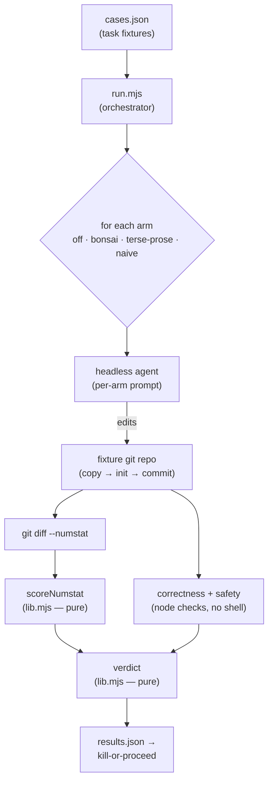
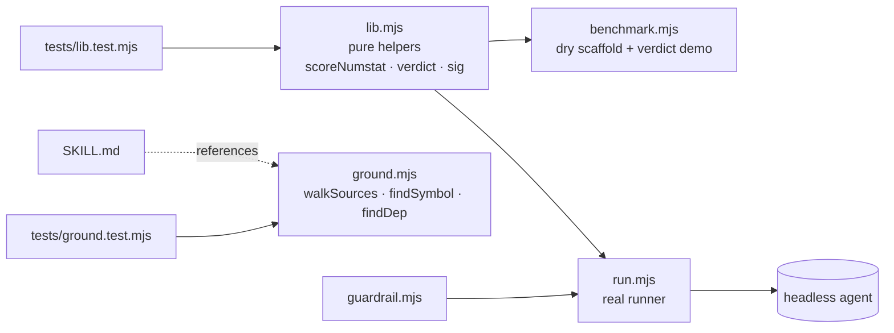

# bonsai — architecture

Zero external runtime dependencies; Node built-ins only. ESM throughout.

## Harness pipeline (Phase-0 validation)

## Module dependency graph

## Layering (dependencies point down)
- **Pure core** (`lib.mjs`): no fs / spawn / network — fully unit-tested.
- **Grounding gate** (`ground.mjs`): importable core + thin CLI.
- **Orchestration** (`run.mjs`, `benchmark.mjs`, `guardrail.mjs`): spawn the agent / git / node; exercised by harness runs and dry smokes.
- **Fixtures** (`scripts/fixtures/*`): throwaway case inputs.

## Test surface
- **Unit** (`tests/lib.test.mjs`): `scoreNumstat`, `sig`, `verdict` (PROCEED / KILL / over-correction).
- **Unit + CLI smoke** (`tests/ground.test.mjs`): `walkSources` / `findSymbol` / `findDep`.
- Coverage (node built-in): ~95% lines on the importable core.
